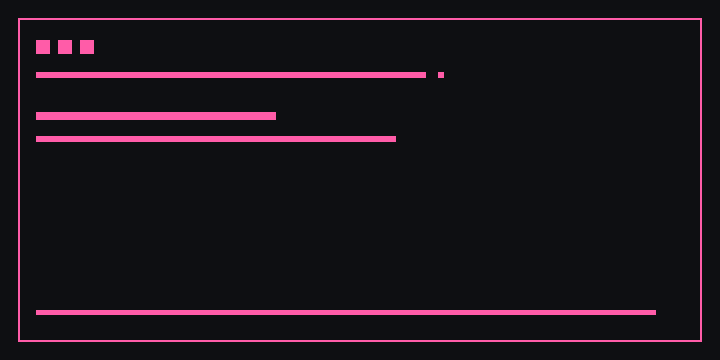

<p align="center"></p>

<h1 align="center">BDFL - Benevolent Dictator For Life</h1>
<p align="center"><strong>BDFL is commanding...</strong></p>
<p align="center">Protect your main context while managed agents work in parallel, ask before crossing boundaries, and integrate only after review and validation.</p>

<p align="center">
  <a href="LICENSE"></a>
  <a href="https://github.com/thisisnsh/bdfl/releases"></a>
  
  <a href="https://github.com/thisisnsh/bdfl/actions/workflows/ci.yml"></a>
  
</p>

<p align="center">
  <a href="#install">Install</a> ·
  <a href="#quick-start">Quick start</a> ·
  <a href="#commands">Commands</a> ·
  <a href="#models">Models</a> ·
  <a href="docs/ARCHITECTURE.md">Architecture</a> ·
  <a href="INSTALL.md">Installation guide</a>
</p>

```text
> /bdfl codex:gpt-5.6-sol:medium
  BDFL is commanding...

Plans · v3 · diff                    Agents
- one provider task                  ✓ api-contract     review
+ split provider and docs            ◌ docs             running
+ validate together                  ? provider-tests   waiting

Inbox
? provider-tests: Which fake Ollama response should represent a missing tag?
> "Return a visible model configuration error."

Tasks
✓ api-contract approved   ✓ docs approved   batch validation passed
> i  Integrate temporary branch bdfl/integration-run-42
```

## Install

```bash
# macOS, Linux, WSL, Git Bash
curl -fsSL https://github.com/thisisnsh/bdfl/releases/latest/download/install.sh | bash
```

```powershell
# Windows PowerShell
irm https://github.com/thisisnsh/bdfl/releases/latest/download/install.ps1 | iex
```

The bootstrap resolves the latest published release, verifies its committed SHA-256 checksum, detects Claude Code and Codex, and installs only detected native integrations. Set `BDFL_VERSION` to pin a specific release. Preview every mutation with `--dry-run`; see [INSTALL.md](INSTALL.md) for update, verification, host-only, and uninstall paths.

### Native host installation

Claude Code:

```text
/plugin marketplace add thisisnsh/bdfl
/plugin install bdfl@bdfl
```

Codex:

```bash
codex plugin marketplace add thisisnsh/bdfl
codex plugin add bdfl@bdfl
```

The packaged standalone Codex skill is also available at [`dist/bdfl.skill`](dist/bdfl.skill).

## Quick start

From a clean Git worktree inside Claude Code or Codex:

```text
/bdfl
> Build the provider adapters and their deterministic test harnesses.
> Keep documentation separate so it can run in parallel.
/bdfl list
```

BDFL does not enter plan mode. Use the host's normal plan mode when you want it; BDFL records revisions while active and opens its version selector after native approval.

## Commands

| Command | Result |
|---|---|
| `/bdfl [provider:model:effort]` | Activate, optionally with an exact listed model. |
| `/bdfl list` | Open Runs, Plans, Tasks, Agents, Inbox, and Models. |
| `/bdfl help` | Show commands, keys, models, permissions, and recovery. |
| `/bdfl off` | Deactivate after running agents are resolved. |

There is deliberately no `/bdfl plan`; native host planning remains native.

## What you get

| Capability | Guarantee |
|---|---|
| Context protection | Agents use a shared process protocol instead of consuming native parent subagent context. |
| Isolated work | Every attempt gets a `.bdfl/` worktree and branch. |
| Versioned planning | Every revision is retained; you choose the execution version. |
| Explicit boundaries | Questions, permission requests, recovery, approval, and integration wait for you. |
| Safe scheduling | Dependency cycles fail early; overlapping paths are serialized. |
| Batch integration | Approved work lands on a temporary branch and is validated before integration is offered. |
| Exact models | Provider, model—including colon-bearing Ollama tags—and effort pass through without fallback. |

## Plans and versions

In Plan detail, up/down selects a revision and left/right switches between diff and full views. Diff additions are green and removals red; full mode shows the selected revision in white. Press `a` to choose the highlighted version. BDFL then compiles a separate execution manifest with objective, context, allowed paths, dependencies, exact model, permission mode, validation commands, and completion criteria for every atomic task.

Outside native plan mode, BDFL compiles the same manifest after material questions are resolved. It dispatches only when at least two tasks are independent or you explicitly ask for agents.

## Agent lifecycle and keys

```text
pending → running → waiting → running → review → approved → validating → integrated
                    ↘ failed / cancelled / rewound → fresh attempt
```

| Key | Action |
|---|---|
| `x` | Stop the highlighted agent. |
| `r` | Rewind from the last safe checkpoint. |
| `f` | Add corrective instructions in a fresh follow-up attempt. |
| `a` | Approve the highlighted plan version or completed task. |
| `i` | Integrate a successfully validated batch. |
| `o` | Open the full diff or log. |
| `?` | Show contextual help. |

Left/right changes tabs, up/down selects rows, Enter opens details, and Esc returns. Available keys stay visible in the bottom row.

## Models

Global settings use your platform configuration directory. Specifications are `provider:exact-model:exact-effort`; parsing uses the first and final colon:

```json
{
  "version": 1,
  "defaultModel": "claude:sonnet:medium",
  "models": [
    "claude:sonnet:medium",
    "claude:opus:medium",
    "claude:haiku:medium",
    "codex:gpt-5.6-sol:medium",
    "ollama:qwen3.5:9b:medium"
  ],
  "maxAgents": 4,
  "ollamaBaseUrl": "http://localhost:11434"
}
```

Claude and Codex use their headless CLIs. Ollama uses the current parent host's supported local-model harness. Preflight checks the executable, authentication surface, exact model, endpoint, and effort; failures become visible task states. See [Model providers](docs/MODEL-PROVIDERS.md).

## Permission and recovery guarantees

- Parent permissions are preserved; parent plan mode maps to ordinary default execution permissions.
- An agent cannot infer an answer or broaden permission.
- A dirty main worktree blocks dispatch until you clean it, authorize a recoverable snapshot, or cancel.
- Unfinished state always offers `resume`, `inspect`, `archive`, or `cancel`; BDFL never chooses for you.
- Rewind retains the prior attempt, branch, logs, events, checkpoints, and session ID.
- Agent work never merges directly into `main`.

Read [Permissions](docs/PERMISSIONS.md) and [Recovery](docs/RECOVERY.md) for the full contract.

## How it works

```text
host request → plan revisions → selected plan → execution manifest
             → isolated task worktrees → inbox/review → integration branch
             → batch validation → explicit integration
```

Canonical runtime code lives in `src/` and the canonical skill in `skills/bdfl/`. Deterministic packaging mirrors both into `plugins/bdfl/`; CI fails on drift.

## Privacy and security

BDFL stores run state, worktrees, normalized events, and logs locally under `.bdfl/`, which is gitignored. Provider prompts and code are sent only through the configured Claude, Codex, or local Ollama harness. BDFL does not run a telemetry service and does not copy authentication tokens into project state. Review [SECURITY.md](SECURITY.md) before using full-access permissions.

## Current limitations

- Codex's supported footer does not accept arbitrary plugin text, so Codex displays the animated yellow banner during activation and throughout BDFL's terminal UI. BDFL does not patch or wrap Codex to fake a permanent footer.
- Claude Code status animation depends on the host invoking its custom status-line command; frames are selected at 500 ms boundaries.
- Headless providers cannot surface every interactive host prompt identically. Unsupported requests fail visibly and remain recoverable.
- Real-provider smoke tests are opt-in; deterministic fake harnesses run in CI.
- No benchmark, speedup, or reliability claim is published without a reproducible measurement.

## Project

[Contributing](CONTRIBUTING.md) · [Documentation](docs/ARCHITECTURE.md) · [Open an issue](https://github.com/thisisnsh/bdfl/issues) · [Security](SECURITY.md) · [Code of Conduct](CODE_OF_CONDUCT.md) · [MIT license](LICENSE)
