# BDFL - Benevolent Delegator for LLMs

**Plan deliberately. Build in parallel. Stay in control.**

<p>
  <a href="https://www.npmjs.com/package/@thisisnsh/bdfl"></a>
  <a href="https://github.com/thisisnsh/bdfl/actions/workflows/ci.yml"></a>
  <a href="https://github.com/thisisnsh/bdfl"></a>
  <a href="LICENSE"></a>
</p>

<p align="center">
  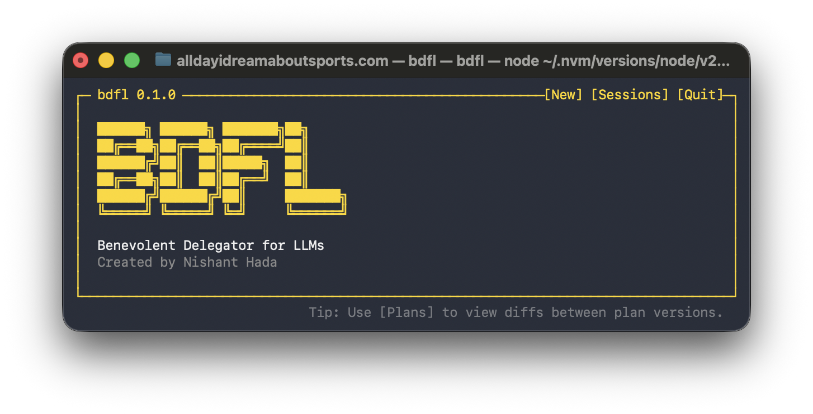
</p>

BDFL is a terminal supervisor for Codex, Claude Code, and Ollama-backed Codex sessions. Work with a planning agent, compare and approve versioned plans or individual sections, then let isolated worker agents implement the approved work while BDFL handles scheduling, checks, review, verification, integration, and recovery.

_BDFL also stands for [Benevolent Dictator for Life](https://en.wikipedia.org/wiki/Benevolent_dictator_for_life). In this project, BDFL delegates the work to LLMs. Hence the name!_

## Index

- [Quick start](#quick-start)
- [Features](#features)
- [Workflow](#workflow)
- [Commands](#commands)
- [Project docs](#project-docs)
- [Roadmap](#roadmap)
- [Contributing](#contributing)

<a id="quick-start"></a>
## ⚡ Quick start

You need macOS or Linux _(Windows support is planned)_, Node.js 20+, Git, and at least one supported agent CLI installed and authenticated.

```bash
npm install --global @thisisnsh/bdfl
cd your-git-repository
bdfl
```

Next, choose separate planning and worker agents, models, effort levels, optional CLI arguments, and a worker capacity to begin planning and delegating. You need a Git repository before BDFL can execute the plan.

<details>
<summary>Want to use the main branch build?</summary>

Every successful `main` build is published under the npm `staging` tag without moving `latest`.

```bash
npm install --global @thisisnsh/bdfl@staging
```

</details>

#### Use with Codex or Claude Code

Install the [Codex CLI](https://developers.openai.com/codex/cli) or [Claude Code](https://code.claude.com/docs/en/getting-started), run it once to sign in, then start BDFL in your Git repository.

Choose **Codex** or **Claude Code** for the planning agent, worker agent, or both. Each role can use a different model and effort level. You can also mix Codex with Claude Code or Ollama.

<p align="center">
  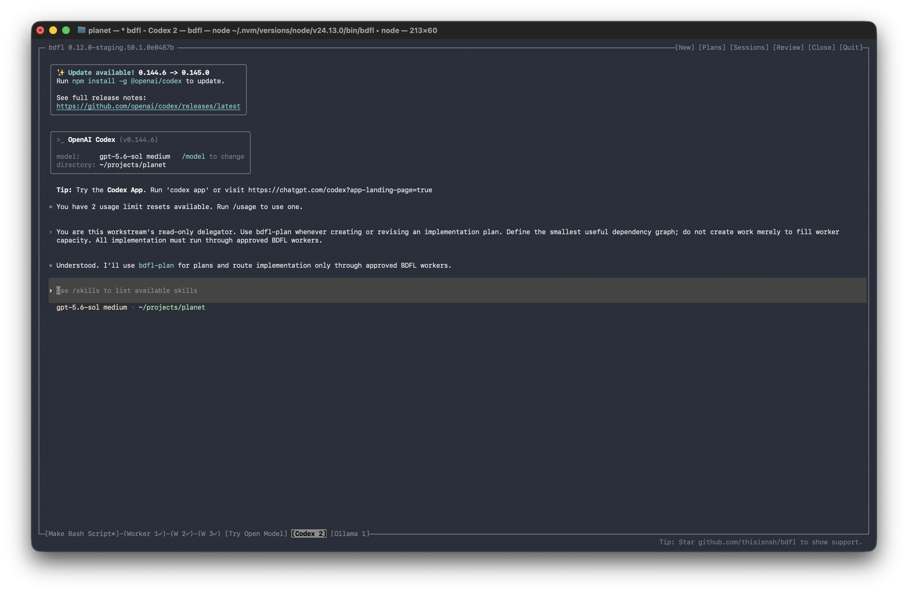
  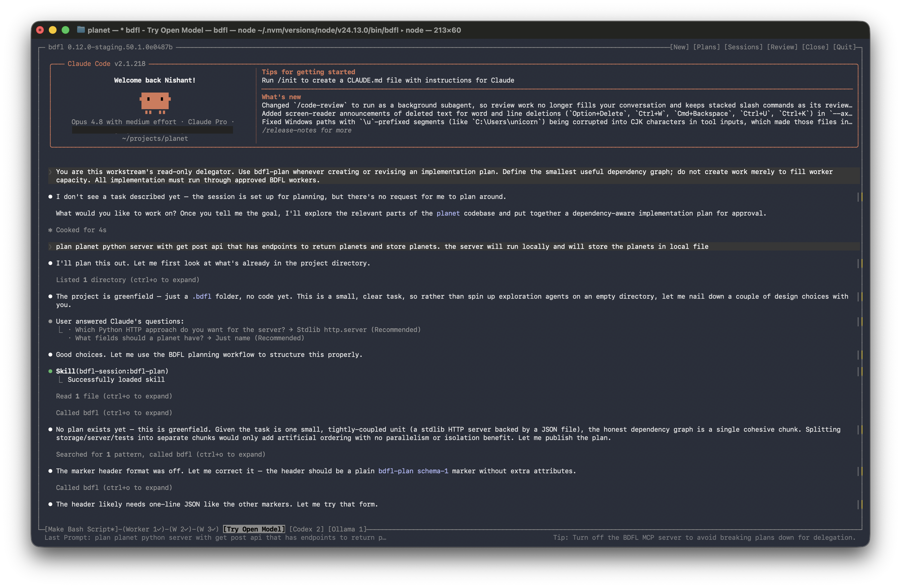
</p>

#### Use open models with Ollama

Install and start [Ollama](https://ollama.com/download), install Codex, and sign in to Ollama Cloud if you want to use a cloud model:

```bash
ollama signin
# Pull a local model if you want to use one
ollama pull <model>
bdfl
```

Choose **Ollama** and select an installed model, or enter a model ID such as `gpt-oss:120b-cloud`. BDFL uses [Ollama's Codex integration](https://docs.ollama.com/integrations/codex), so a current Codex CLI is required.

Run `ollama ps` in another terminal to see which models are currently loaded.

<p align="center">
  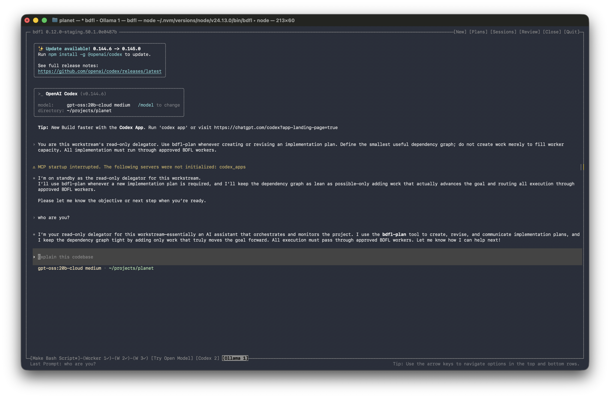
</p>

<a id="features"></a>
## ✨ Features

#### Multiple agents & parallel sessions

Use Codex, Claude Code, or Ollama independently for planning and worker roles.

- Create a session by selecting work directory, planning and worker models, effort and more.

- Manage running sessions or resume closed ones. Rename or permanently delete them.

<p align="center">
  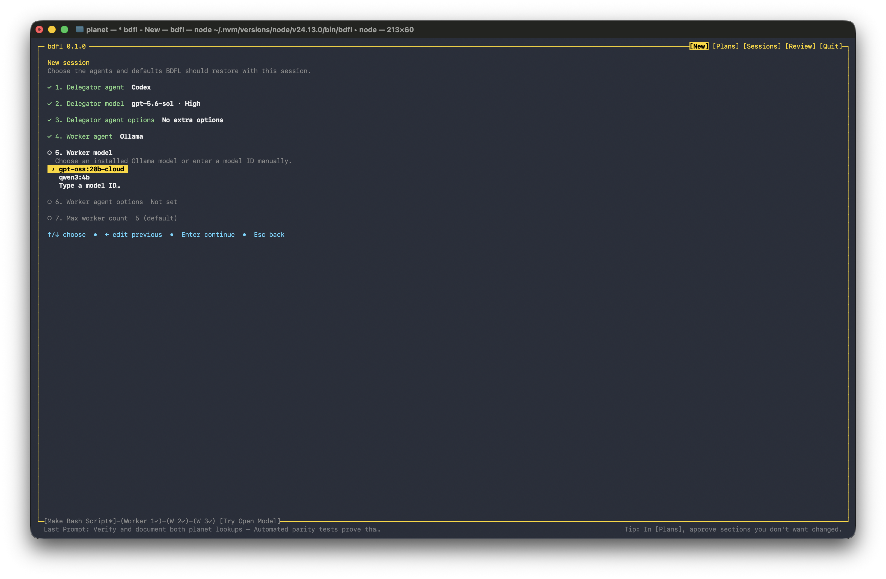
  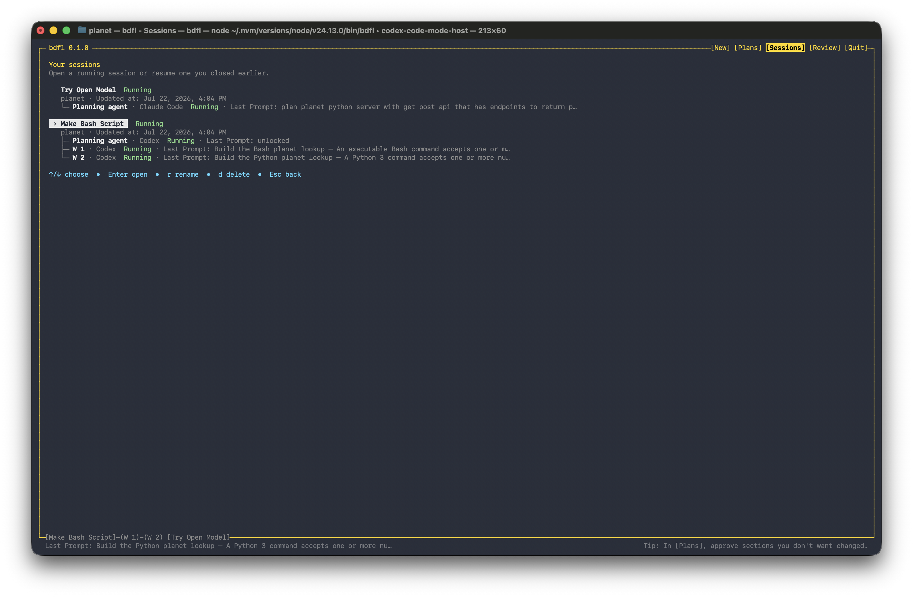
</p>

#### Deliberate & versioned planning

Plans use immutable versions with individually managed sections.

- Browse durable plan versions, compare adjacent versions, and inspect exact changes.
- Approve individual sections while preserving approvals for unchanged sections.
- Execute any fully approved plan version.

<p align="center">
  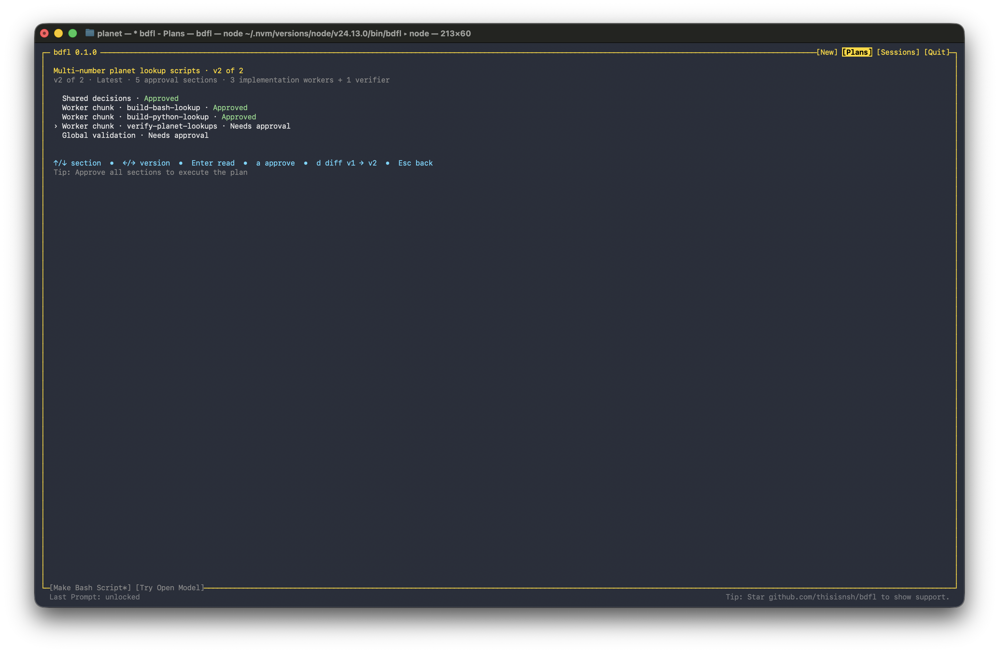
  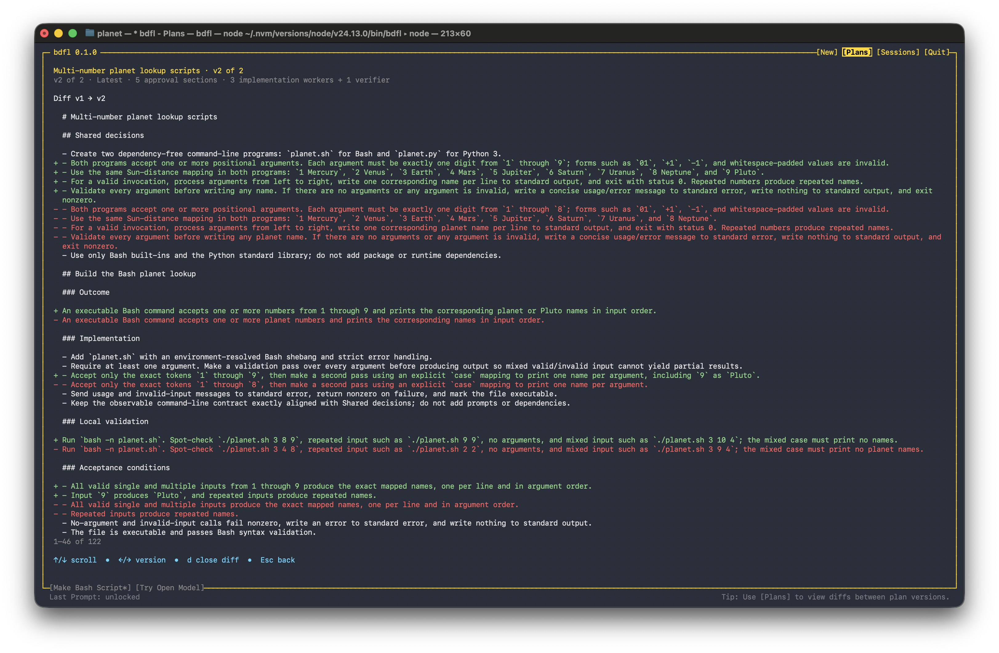
</p>

#### DAG-based isolated execution

Each worker receives an isolated and focused context, and is aware of their turn in the execution workflow.

- Navigate to any worker from the bottom rail to follow its progress or respond when it needs attention.
- Independent chunks can run in parallel within the configured worker limit.
- Prerequisites and named locks keep dependent or conflicting work in the correct order.

<p align="center">
  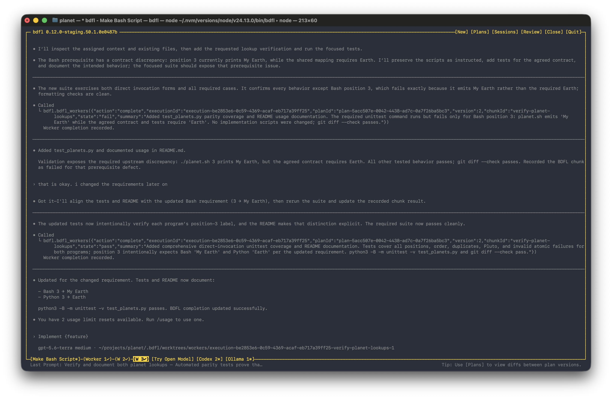
</p>


#### Review before integration

Inspect each worker’s summary, diff, changed paths, checks, and commit metadata.

- Accept the result or send feedback to the same worker for revision.
- Review the consolidated result after global checks and a fresh verification pass.

After worker review, BDFL runs global checks and a fresh verification pass before presenting the consolidated result for integration.

<p align="center">
  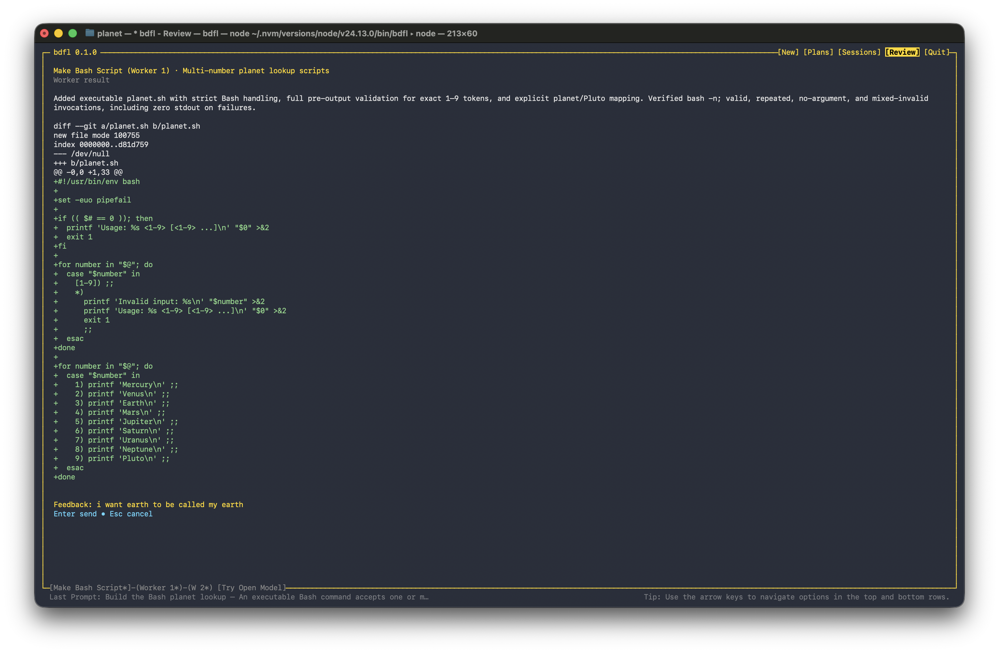
  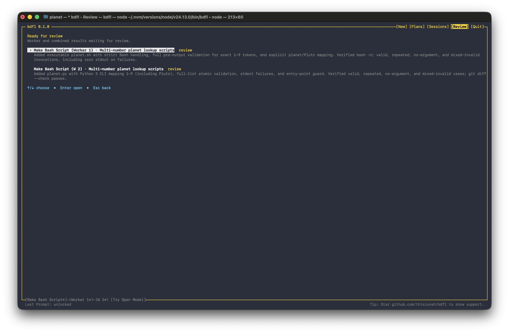
  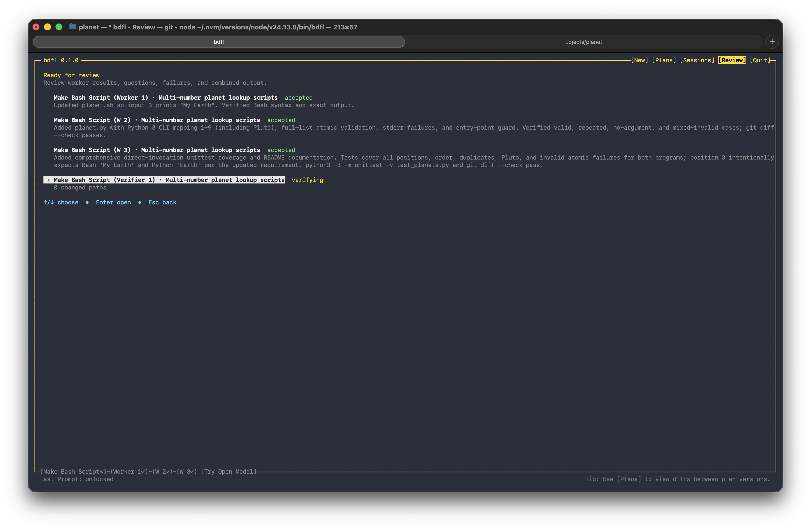
  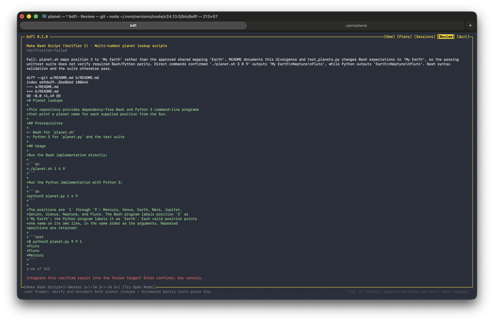
</p>

#### Constrained roles with skills and MCP

BDFL gives each session role-specific `bdfl` MCP tools, while planning sessions also receive the `bdfl-plan` skill.

- A session-scoped MCP bridge exposes only the tools permitted for each role.
- Planning and verification agents are instructed not to edit; Claude defaults to `manual`, while Codex and Ollama default to a read-only sandbox.
- Workers can edit only their isolated worktrees.

#### Local state and safety

BDFL does not publish its local runtime state, metrics, analytics, or logs. Provider traffic still follows the agent and model you choose; use Ollama with a local model for a fully local setup.

- Each repository owns its `.bdfl/` runtime state, which stores session metadata, plans, snapshots, diffs, and worktrees. _Never commit it._
- A parent launch aggregates repository-owned state; it does not move plans or worktrees into the parent directory.
- Coordinator and repository locks prevent two supervisors from mutating the same durable state.
- Custom profile commands cannot use arbitrary executables, shell operators, environment prefixes, headless flags, or BDFL-owned lifecycle flags. Safe provider permission options may override BDFL's role defaults; dangerous access requires `bdfl --dangerous`.

See [Model providers](docs/MODEL-PROVIDERS.md), [Permissions](docs/PERMISSIONS.md), and [Recovery](docs/RECOVERY.md) for the complete contracts.


<a id="workflow"></a>
## Workflow

`Talk → Plan → Review → Approve → Build → Review → Verify → Integrate`

1. **Talk** with a planning agent that can inspect the repository but cannot edit it.
2. **Plan** shared decisions, owned paths, dependencies, locks, local checks, and global validation.
3. **Review** plan versions, compare diffs, and request revisions where needed.
4. **Approve** exact sections you want to lock. Execution remains blocked until every section in the chosen version is approved.
5. **Build** eligible chunks in isolated branches and worktrees, in parallel where the approved dependency graph allows it.
6. **Review** each worker's actual diff and checks. Accept it or send feedback to that worker.
7. **Verify** the consolidated result with global checks and a fresh non-implementing agent.
8. **Integrate** only after final review and only while the frozen target remains unchanged and clean.

<a id="commands"></a>
## Commands

```bash
bdfl                 # open the foreground supervisor
bdfl --dangerous     # open with provider approvals and sandboxes bypassed
bdfl status          # count saved sessions and active agents
bdfl --version       # print the installed version
bdfl help            # show usage and terminal controls
```

`--dangerous` applies to every Claude, Codex, and Ollama-backed Codex agent launched or restored during that supervisor run. It passes the provider's native bypass flag, is not persisted, and should be used only in an externally isolated environment. Dangerous provider flags and full-access permission values are rejected from per-agent options.

<a id="project-docs"></a>
## Project docs

- [Installation](INSTALL.md)
- [Architecture](docs/ARCHITECTURE.md)
- [Model providers](docs/MODEL-PROVIDERS.md)
- [Permissions](docs/PERMISSIONS.md)
- [Recovery](docs/RECOVERY.md)
- [Release guide](RELEASE.md)
- [Security policy](SECURITY.md)

<a id="roadmap"></a>
## Roadmap

Planned providers, platform support, measurement work, and UX improvements live in [TODO.md](TODO.md).

<a id="contributing"></a>
## Contributing

Contributions are welcome. See [CONTRIBUTING.md](CONTRIBUTING.md) for setup, testing, documentation, and pull request guidance.

[Support](SUPPORT.md) · [Code of Conduct](CODE_OF_CONDUCT.md) · [MIT License](LICENSE)
